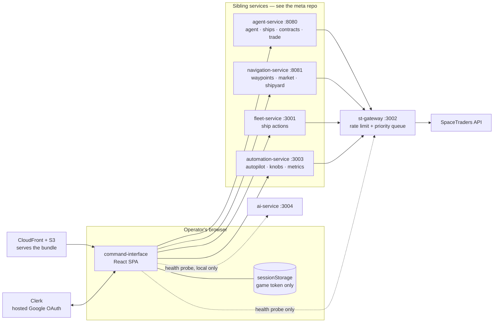
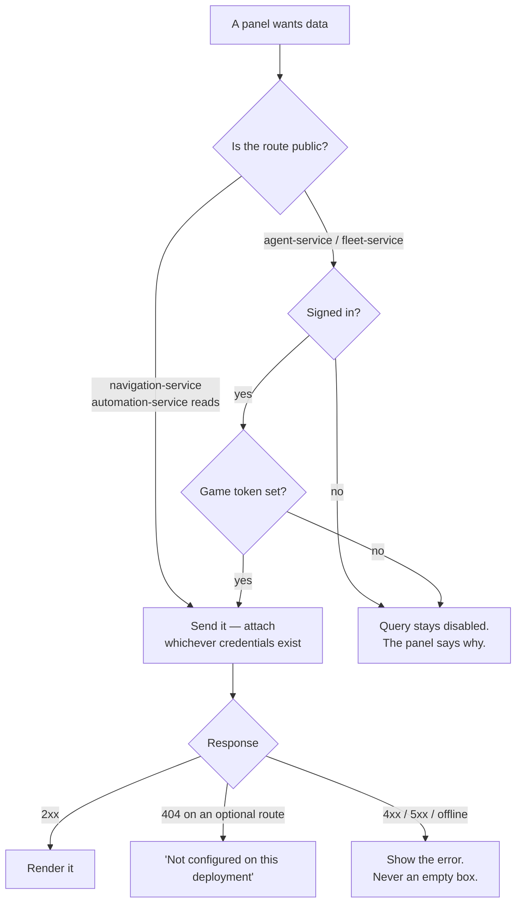
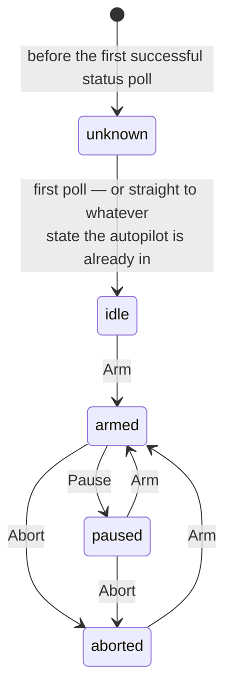
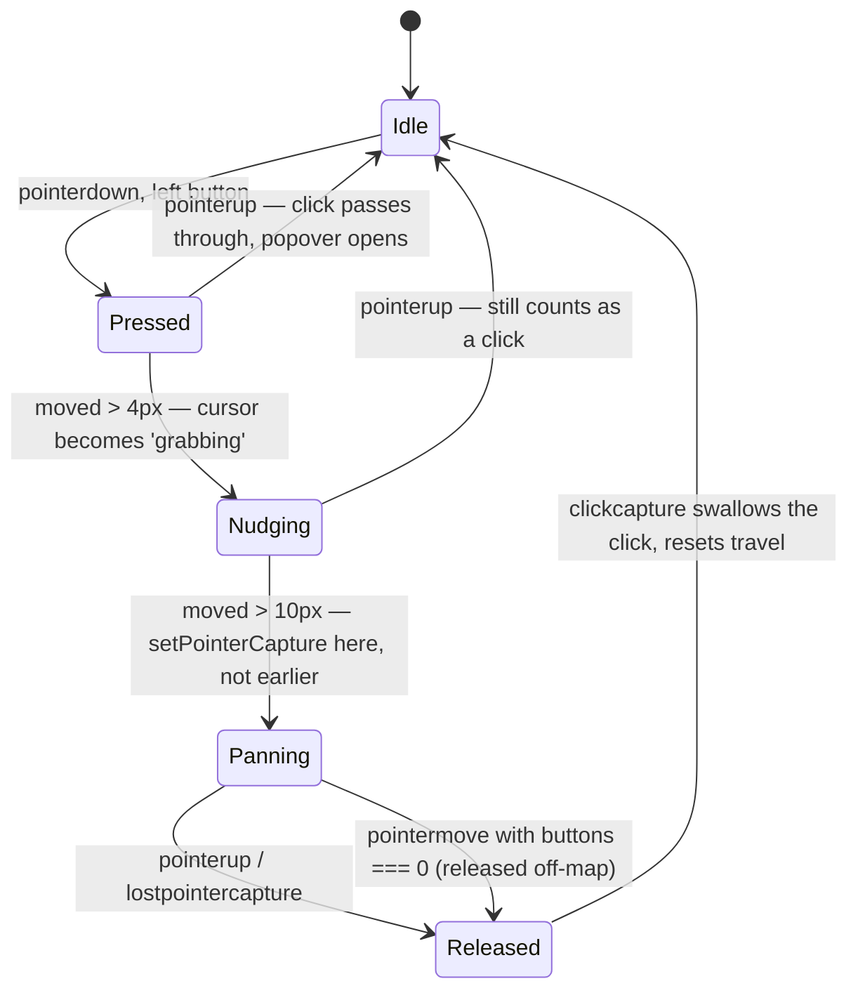

# Command Interface

The bridge display for the V&M SpaceTraders mining POC: a React/Vite single-page
app, styled after LCARS, that shows one star system as a live map and lets an
operator fly the fleet by hand or watch the autopilot fly it for them.

It has no server of its own. It is a browser client for five sibling backends,
deployed as static files to S3 behind CloudFront.

**The part that actually matters is the map**, and the reason it is unusual is
that SpaceTraders gives a moon *the exact same x/y as the planet it orbits*. No
amount of geometric zoom separates two bodies at identical coordinates, so the
map does not magnify — it *fans* co-located bodies onto a ring and then grows
spacing faster than it grows icons. [Everything about how that works is below.](#system-map)

The second thing worth knowing before reading the code: **there is no login
wall**. The dashboard renders for anyone. Signing in and pasting a game token
each unlock more of it, and gated controls render *disabled and visible* rather
than hidden, so what exists and what is withheld is never ambiguous.

## Architecture



The app stores nothing anywhere except the pasted game token, in
`sessionStorage`, which the browser clears when the tab closes. Everything else
on screen is polled and thrown away.

| Service | What this app asks it for | Reachable without credentials? |
| --- | --- | --- |
| **agent-service** `:8080` | Agent stats, ship list, contracts, cargo purchase/sale, ship purchase | No — needs a Clerk session *and* a game token |
| **navigation-service** `:8081` | System waypoints, market and shipyard data | Yes — serves its SQLite cache; a game token upgrades it to a live fetch-on-miss |
| **fleet-service** `:3001` | Orbit, dock, navigate, survey, extract, refuel, transfer, flight mode, contract delivery | No — needs `fleet:control` *and* a game token |
| **automation-service** `:3003` | Autopilot arm/pause/abort, per-ship task state, planner knobs, metrics rollups, anomaly digest | Reads yes, writes need `fleet:control` |
| **st-gateway** `:3002` | Nothing directly — health probe only. It is the rate-limited chokepoint the four services above share | Health probe is public |
| **ai-service** `:3004` | Nothing yet — health probe only, and only in local development | See [known limitations](#known-limitations) |

## Auth model

Two different credentials do two different jobs, and neither is a login.

| | Clerk session | SpaceTraders game token |
| --- | --- | --- |
| Answers | *Who are you, and may you act?* | *Which agent's game is this?* |
| Travels as | `Authorization: Bearer …` | `X-SpaceTraders-Token: …` |
| Obtained by | Google sign-in, from the agent bar | Pasted, from the agent bar |
| Held in | Clerk's SDK, refreshed automatically | `sessionStorage`, cleared with the tab |
| Grants | `fleet:control` → every write in the UI | The ability to make any live upstream call at all |
| Goes away when | — | st-gateway starts injecting it (auth-design decision 5) |

Every request also carries `X-Priority: interactive`, which the backends
propagate to st-gateway's priority queue so a human clicking a button is not
stuck behind the autopilot's background traffic.



Scopes are read by decoding the Clerk JWT in the browser. That is **optimistic
and unverified** — it decides whether a button renders enabled, nothing more.
Every gated route verifies the signature and the scope server-side, so editing
this bundle to re-enable a control earns a 403, not an armed autopilot.

## Running locally

```
npm install
npm run dev      # http://localhost:3000
npm test         # vitest, 77 tests
npm run build    # static bundle into dist/
```

Port 3000 is pinned in `vite.config.js` because it is the backends' default CORS
origin. Copy `.env.example` to `.env.local` to point at non-default URLs.

| Variable | Default | Notes |
| --- | --- | --- |
| `VITE_CLERK_PUBLISHABLE_KEY` | *none* | **Required.** Public by design — it names the instance and authorizes nothing. Without it the app renders a setup message instead of the dashboard. The backends' committed dev keypair does not cover the browser: minting a session needs a real Clerk development instance. |
| `VITE_AGENT_SERVICE_URL` | `http://localhost:8080/api/agent/v1` | |
| `VITE_NAVIGATION_SERVICE_URL` | `http://localhost:8081/api/navigation/v1` | |
| `VITE_FLEET_SERVICE_URL` | `http://localhost:3001/api/fleet/v1` | |
| `VITE_AUTOMATION_SERVICE_URL` | `http://localhost:3003/api/automation/v1` | |
| `VITE_ST_GATEWAY_URL` | `http://localhost:3002` | Health probe only |
| `VITE_AI_SERVICE_URL` | `http://localhost:3004` | Health probe only, and only locally |

`/dev-map.html` renders the map alone against stubbed responses — no token, no
Clerk instance, no backends. Its generated system mirrors a real one's density
(83 waypoints, 58 of them asteroids, ships parked on planets, one ship in
transit), because that density is what surfaces the layout and hit-testing bugs
a four-waypoint mock never will. Vite only bundles `index.html`, so it never
ships.

Deploys are `.github/workflows/deploy.yml`: every push to `main` builds and syncs
`dist/` to S3, then invalidates CloudFront. Backend URLs are baked in at build
time as workflow env, which is why a new one has to be added there as well as to
`.env.example`.

## What is on screen

The dashboard is one screen: an agent bar across the top, three columns beneath
it — fleet list, system map, ship detail — and the command-console stub below.
Four overlay panels toggle in from the agent bar on top of that.

All four overlay panels can be open at once. `src/utils/togglePanelLayout.js`
computes each open panel's `right` offset from *only the panels currently open*,
so one open panel always sits at the base offset no matter how many panel types
exist. Adding a fifth means adding one entry there, not re-deriving four
hardcoded offsets.

| Panel | Reads | Writes | Gated on |
| --- | --- | --- | --- |
| **Contracts** | `GET /contracts` | Accept, fulfill | `fleet:control` |
| **Autopilot** | `GET /autopilot/status` | Arm, pause, abort | `fleet:control` |
| **Observability** | `GET /metrics/context`, `GET /anomalies/digest` | — | nothing; public |
| **Knobs** | `GET /planner/knobs` | `PUT /planner/knobs/:name` | reads public, writes `fleet:control` |

### Autopilot

Arming is allowed from any state — that is how you switch live↔shadow or replace
the token automation-service is holding. Only pause and abort care where you are.



The panel polls `GET /autopilot/status` every 5s and enables Pause only while
`armed`, Abort while `armed` or `paused`, and Arm always. `unknown` is the
pre-first-poll state only — once a status has arrived, a later failed poll keeps
showing the last one rather than reverting. A ship the autopilot
is not managing 404s on its per-ship route — that is a normal *not managed*
state, shown as a blank badge, not an error.

### Knobs

Knobs are grouped by class, ordered from "safe to tune" to "think first", because
the classes mean genuinely different things:

| Class | What it is | Who may change it |
| --- | --- | --- |
| **policy** | Your preferences. No measurable right answer. | Operator, and the AI supervisor |
| **alert** | What counts as something being wrong. | Operator only — the AI cannot widen its own alarms |
| **model** | What the planner believes about the universe, measured from the fleet's own history. Pinning one by hand changes what the planner believes rather than what is true. | Operator, carefully |

Bounds are checked client-side against the same inclusive `[min, max]` the server
enforces, so an out-of-range value shows an inline error instead of a round trip.
The list polls every 15s; a row with unsaved input keeps it even if the server
value changes underneath, while an untouched row adopts the new value silently.
Saving is last-write-wins.

### Observability

Four sections over automation-service's aggregate endpoints: a hand-rolled inline
SVG credits/hour chart (no charting library — same convention as the map), the
planner's event/decision feed, the anomaly log with webhook-delivery state, and
the digest's notable events. Every value the chart shows on hover is also listed
as plain text beneath it; nothing is hover-only.

Metrics rollups and anomaly detection are both *optional* backend features. A 404
from either means the operator never enabled it — the panel says so, which is a
different sentence from "this failed" and from "there is nothing to show".

## System map

Rendered as SVG in the DOM — no rendering library. The scale is ~10–100 waypoints
and under 20 ships, and staying in the DOM keeps LCARS CSS variables, popovers
and hit-testing free. The map is split into pure modules under `src/map/` and
thin layer components that draw what those modules produce.

**Zoom separates, it doesn't magnify.** SpaceTraders gives orbitals — moons,
orbital stations, fuel stations that `orbits` a body — the *exact same* x/y as
their parent. Three things fix that:

- `buildSystemLayout` fans a body's orbitals onto a ring around it. Ring radius
  lives in base coordinates, so it scales linearly with zoom. The ring is drawn
  only while its family is hovered — hovering a parent or any of its orbitals
  fades in that one ring, so you get the "these belong together" cue exactly when
  you are asking the question.
- Ring rotation is **neighbour-aware**: each ring aims its widest gap at the
  nearest other body. Seeding each ring independently from `hash(parent)` looked
  fine on a small mock, but in a real 93-waypoint system every close pair was a
  collision between two *different* families — a moon of one planet landing on a
  station of the next. Same-ring spacing was never the problem.
- Icons grow **sub-linearly**, `size × scale^0.3`. At max zoom spacing is 32×
  wider while a planet is only ~2.8× bigger — a net ~11× separation gain. Labels,
  strokes and badges are counter-scaled to a fixed pixel size the same way.

| Constant | Value | Why |
| --- | --- | --- |
| `MIN_SCALE` | 1 | Fit-to-system; there is nothing to pan to, so pan pins at 0 |
| `MAX_SCALE` | 32 | A real 93-waypoint system compresses distinct bodies to ~1.7px apart at fit; 8× could not pull those past their own icon widths. At 32× that system has zero overlapping icon pairs |
| `ZOOM_STEP` | 1.3 | Fit → max is ~13 notches rather than ~19 |
| `ICON_ZOOM_EXPONENT` | 0.3 | The sub-linear growth above |
| `FIT_PADDING` | 44px | Room for orbit rings and labels at the system edge |
| `HIT_PAD_SCREEN` | 5px | Click-target margin past an icon's edge, capped per node by `clearance` |
| `SHIP_PARK_CLEARANCE` | 10 | Gap between a body's edge and the ships parked around it |

Everything positional resolves through the layout index **by symbol**.
`nav.route.origin/destination` carry raw API coordinates, which for a moon are
its *parent's* — a coordinate-based renderer draws ships flying to the wrong body
once orbitals are offset.

### Hit targets

Hit targets are geometric, not fixed. Each waypoint gets a circular target padded
5px beyond its icon, capped per node by `clearance` — the room it has before
reaching another body's *drawn edge*. An isolated gas giant takes the full
margin; an orbital station wedged against its planet takes none. Idle ships park
in a ring clear of the body they are at, sized to that body's radius, fanning out
evenly when several share it.

All of it exists because ships drawn dead-centre on a waypoint, plus flat
inflation of small icons, left a planet with three ships on it **16% clickable**.
Bodies now measure 100%. Note the budget is room to a neighbour's *edge*, not
half the distance to its centre: a planet's icon already reaches past the
midpoint to its own moons, so a midpoint rule puts moons back on top of it.

The one remaining case is a ship in transit passing over a body, which takes the
click because it is genuinely drawn on top.

### Pointer gestures

One trap cost a release: **do not `setPointerCapture` on the `<svg>` when the
press starts.** `click` fires at the nearest common ancestor of the pointerdown
and pointerup targets, and capture retargets pointerup to the capture element —
so every click on a waypoint was delivered to the `<svg>`, which read it as
"clicked empty space" and closed the popover instead of opening it.

Capture is taken lazily, at exactly the threshold that suppresses the click, so a
captured gesture is only ever one whose click was going to be discarded anyway.



`moved` lives in a ref, not in state: the click that ends a gesture is dispatched
before React has necessarily re-rendered, so a state read there would be stale.

### Sprites

Pixel art authored in code: character grids — procedurally generated for spheres,
rocks, rings and clouds, hand-drawn for ship silhouettes and badges — compiled
once at load into run-length-merged `<rect>`s inside an SVG `<symbol>`. Crisp at
any zoom, no binary assets, no build step.

All 14 `WaypointType`s are covered, with deterministic per-symbol variants so a
system does not read as copy-paste, plus corner badges for MARKETPLACE /
SHIPYARD / under-construction. Celestial bodies use naturalistic colours; the
LCARS palette stays on the chrome around them — labels, rings, transit paths,
selection, badges. Ships collapse 16 frames into 5 silhouette families sized by
mass, rotate to their heading, tint by nav status via `currentColor`, and carry a
role badge for the five roles this fleet flies. Hovering a badge names it: a 5×5
glyph can hint at a meaning but never state one.

### Controls

| Input | Does |
| --- | --- |
| Wheel | Zoom about the cursor |
| Drag | Pan |
| `+` / `=` / `−` / `_` | Zoom about the centre |
| Arrow keys | Pan by 48px |
| `0` | Fit to system |
| `+` / `−` / `⌂` buttons | Same, for trackpads and discoverability |
| Click a waypoint or ship | Centres it *and* opens its popover |

Only one popover is open at a time. The ship popover re-reads from the live ships
list, so its ETA and gauges stay current as the poll refreshes underneath it.
In-transit ships interpolate between departure and arrival on a **single** shared
rAF clock that stops when nothing is moving.

## Testing

`npm test` runs vitest under jsdom: 77 tests across the pure map modules (layout,
viewport math, sprite compilation, panel offsets), the API response layer, and
the hooks and small components that decide what a panel says when it has no data.

There are no tests for the large panels. The dev map harness is the manual level
above that — every hit-testing and overlap number quoted here was measured there.

## Known limitations

Things this implementation deliberately does not do, or does not do yet.

- **One system.** The map draws the agent's headquarters system and nothing else.
  `src/map/viewport.js` is deliberately free of any system knowledge so a future
  sector map can reuse it, but no such map exists.
- **Anonymous visitors see the map, not the fleet.** navigation-service serves
  waypoints without credentials, but agent-service holds no game credential of
  its own, so ships, contracts and agent stats need both a signed-in operator and
  a pasted token. That ends when auth-service and st-gateway injection ship.
- **Surveys live in the browser only.** They are held per ship, in memory, and
  are gone on reload. Nothing prunes expired ones from the list; they render as
  `EXPIRED` with the Extract button disabled.
- **The command console executes nothing.** It is a design stub with a canned
  reply.
- **ai-service is not health-checked in production.** It has no CloudFront origin,
  so its URL falls back to `http://localhost:3004`, which an https page cannot
  fetch. Rather than show a permanently red dot about a service it cannot reach,
  the app drops any target it cannot probe from the current page.
- **No linter or formatter is configured.** Style is by convention and review.
- **The map re-renders wholesale while a ship is in transit**, at rAF rate. Fine
  at this scale — ~100 waypoints, <20 ships — and the clock stops entirely when
  nothing is moving, but it is not a budget that survives a much bigger system.
- **Knob edits are last-write-wins.** Two operators saving the same knob race,
  and the loser is not told.
- **Alerts are transient.** Errors surface as auto-dismissing banners with no
  history; a failure you miss is gone.

## Design source

`lcars-reference-files/` holds the original LCARS Ultra kit — three palettes, the
Antonio font, full HTML templates — this UI's look was distilled from. Kept for
reference when extending the design system, not part of the build.
